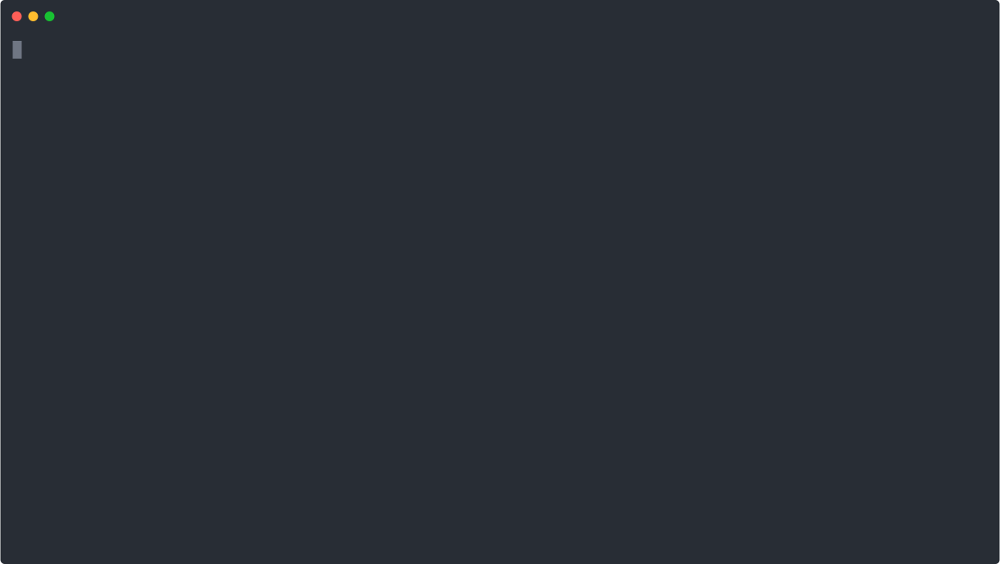

# Lima tool box

A set of command line tools which hopefully ease the configuration and
development of [Lima](http://github.com/esrf-bliss/lima) cameras.



## Disclaimer

The current version depends on a version of Lima with the feature
"Lima as namespace package" accepted. At the time of writing this doc
it is still not the case
(see [PR #116](https://github.com/esrf-bliss/Lima/pull/116)).

If you still want to try it out you need to replace your Lima installation
`Lima/__init__.py` file with one with the simple content:

```python
__path__ = __import__('pkgutil').extend_path(__path__, __name__)
```

## Installation

**TL;DR**

From within your favorite python environment, type:

```pip install lima-toolbox[all]```

<br/>
The toolbox is composed of a core library and plug-ins for diverse set of
cameras.

The core can be installed with:

```pip install lima-toolbox```

To install support for specific camera(s) use (example):

```pip install lima-toolbox[basler,eiger]```

At the end you can find a mini-catalog of the available cameras.

PRs which implement new cameras (or improve, or fix existing ones) are most
welcome.

## CLI

Probably the most useful tool is the CLI. You can use it to discover cameras
on the network, display information about a specfic camera and even perform
acquisitions.

The lima CLI provides global commands like `scan` which are not camera specific.
In addtition, each camera provides its own set of sub-commands. They are accessible
by typing `lima <camera> <sub-command>` (ex: `lima eiger --host=bl99eiger info`).

Typing ```lima --help``` will display help. Help is context sensitive, so
typing ```lima basler --help``` will display help for the basler subset of
commands.

### camera discovery

camera toolbox plug-ins which provide *scan* capability allow you to
discover them by using the `scan` command:

```console
$ lima scan --table-style=box_rounded

Basler:
╭──────────────┬──────────────────────────────┬───────────────────────┬───────────┬────────────┬───────────┬────────╮
│    Class     │        Friendly name         │       Full name       │   Name    │ Serial Nb. │ User name │ Vendor │
├──────────────┼──────────────────────────────┼───────────────────────┼───────────┼────────────┼───────────┼────────┤
│ BaslerCamEmu │ Basler Emulation (0815-0000) │ Emulation (0815-0000) │ Emulation │ 0815-0000  │           │ Basler │
├──────────────┼──────────────────────────────┼───────────────────────┼───────────┼────────────┼───────────┼────────┤
│ BaslerCamEmu │ Basler Emulation (0815-0001) │ Emulation (0815-0001) │ Emulation │ 0815-0001  │           │ Basler │
├──────────────┼──────────────────────────────┼───────────────────────┼───────────┼────────────┼───────────┼────────┤
│ BaslerCamEmu │ Basler Emulation (0815-0002) │ Emulation (0815-0002) │ Emulation │ 0815-0002  │           │ Basler │
╰──────────────┴──────────────────────────────┴───────────────────────┴───────────┴────────────┴───────────┴────────╯

Eiger:
╭───────────┬───────────┬─────────────┬──────┬───────╮
│   Host    │ Alias(es) │ Address(es) │ Port │  API  │
├───────────┼───────────┼─────────────┼──────┼───────┤
│ bl04eiger │           │ 172.95.4.11 │ 8000 │ 1.6.0 │
╰───────────┴───────────┴─────────────┴──────┴───────╯

MythenSLS:
╭────────────┬─────────────┬──────┬────────┬──────────┬──────────┬───────────┬────────────╮
│    Host    │     IP      │ Port │  Type  │ #Modules │ Settings │ Threshold │ Dyn. Range │
├────────────┼─────────────┼──────┼────────┼──────────┼──────────┼───────────┼────────────┤
│ bl04mythen │ 172.95.4.10 │ 1952 │ MYTHEN │    6     │ STANDARD │   9071    │     32     │
╰────────────┴─────────────┴──────┴────────┴──────────┴──────────┴───────────┴────────────╯
```

Here you can see 3 simulated [Basler](https://github.com/esrf-bliss/lima-camera-basler) cameras, an
[Eiger](https://github.com/esrf-bliss/lima-camera-eiger) camera and a [Mythen SLS](https://github.com/alba-synchrotron/sls-detector) camera are available.

### Common camera commands

As mentioned above, each camera provides its own set of specific sub-commands.
The sub-commands `info` and `acquire` are common to all cameras (altough the specific
sub-command options could vary).

The set of options which identify a camera are specific to each camera. For example,
to identify an eiger you must provide the `--url=<hostname>` option.

Note that there is nothing enforcing a specific camera to implement any of the
common sub-commands. But it is considered good taste if a plugin does it (for the sake
of coherency).

A camera plugin may optionally implement the `scan` command. It should provide the same
result as the global scan with results restricted to the camera type.

#### Camera information

Basic information about a camera can be retrieved with the `info` sub-command.

Examples:

```console
$ lima eiger --url=bl04eiger info
    CurrImageType: 10
     DefImageType: 10
DetectorImageSize: <3110x3269>
    DetectorModel: Dectris Eiger 9M
     DetectorType: E-18-0102
   InstrumentName: instrument
     MaxImageSize: <3110x3269>
        PixelSize: (7.5e-05, 7.5e-05)
 UserDetectorName: E-18-0102

$ lima mythensls --url bl04mythen info
      CurrImageType   10
       DefImageType   10
  DetectorImageSize   <7680x1>
      DetectorModel   Mythen-II
       DetectorType   MythenSLS
     InstrumentName   instrument
       MaxImageSize   <7680x1>
          PixelSize   (1.0, 1.0)
   UserDetectorName   MythenSLS

      Detector type   MYTHEN
      Serial number   1719109785
   Software version   1867412
             Status   IDLE
      Dynamic range   32
   Energy threshold   9071
      Exposure time   1.0
   Number of frames   0
   Number of cycles   0
    Number of gates   0
             Master   NO_MASTER
    Synchronization   NONE
             Timing   AUTO_TIMING
 Delay after triger   0.0
            Readout   NORMAL_READOUT
           Settings   STANDARD
   External signals   ['GATE_OUT_ACTIVE_HIGH', 'TRIGGER_IN_RISING_EDGE', 'OFF',
                       'OFF']
```

### Camera acquisition

Aquisitions can be made with the `acquire` sub-command.

The common options include `-nb-frames`, `--exposure-time`, `--latency-time`. You
can see the complete list of options with `lima <camera> acquire --help`.

Here is an example performing an acquisition on an eiger camera:


## How to write a plug-in for your camera

You have two options:

### 1. Add a plug-in extension to Lima-toolbox

Write a PR to this repo with the camera you intend to add. This should always be
possible independently of the type of camera you are writing the plug-in for.

Let's say you want to create a plugin for the
[Simulator](http://github.com/esrf-bliss/lima-camera-simulator) camera.

First,create a new file in `src/Lima/toolbox/camera` called `simulator.py`.
The lima toolbox CLI uses the [click](https://click.palletsprojects.com) library
to help create a powerful command line interface.

To create a `simulator` sub-command you can simply use the lima toolbox `camera`
decorator (a `click.group` helper) and write a function which should return a
`Lima.Interface` object:

```python
# src/Lima/toolbox/camera/simulator.py

from Lima.toolbox.cli import camera
from Lima.Simulator import Camera, Interface


@camera(name='simulator')
def simulator():
    camera = Simulator.Camera()
    interface = Interface(camera)
    return interface
```

The second and last thing to do is to register the new command in the lima toolbox
setup.py like this:

```python
extras_require = {
    "simulator": []  #  add any extra python dependencies if necessary
}

setup(
    ...,
    entry_points={
        "lima.cli.camera": [
            ...
            "Simulator = Lima.toolbox.camera.simulator:simulator [simulator]"
        ]
    }
)
```

That's it. Next time you install lima-toolbox there should be a `simulator`
camera available with the default `info` and `acquire` sub-commands available
*out of the box*.

Congratulations! You are now ready to make a PR to this repo with your new camera.

Read further to find how to implement camera options, details about the camera
decorator and how to implement your own camera specific sub-commands.

Examples of existing cameras can be found in the `src/Lima/toolbox/camera` directory.

#### Custom options

If you need to add any option to the command line to identify or configure your
camera you can do it using `click.option`. Here is an example extending the
previous one:

```python
import click

@camera(name='simulator')
@click.option(
   '--fill-type',
   click.Choice(['gauss', 'diffraction'],
   case_sensitive=False),
   default='gauss')
def simulator(fill_type):
    camera = Simulator.Camera()
    interface = Interface(camera)
    fill_type = getattr(Lima.Simulator.FrameBuilder, fill_type.capitalize())
    frame_getter = camera.getFrameGetter()
    frame_getter.setFillType(fill_type)
    return interface
```

#### The `camera` decorator

The `@camera` decorator helper provides a `click.group` decorator enhanced with
the `info` and `acquire` sub-commands by default and the facility that the
returned interface gets inserted into the click context object
`ctx.obj['interface']` which can be accessed by any camera sub-commands you
decide to implement.

Here is an example on how to implement a specific sub-command:

```python

@simulator.command("initialize")
def initialize(self):
    # Initialization code here
    ...

```

### scan command

The lima toolbox CLI implements global `scan` command which has the purpose
of discovering all the cameras in the system.

To make the specific `scan` command of your system visible to the global scan
command you need to register a scan function with the signature:

```python
[async] def scan(timeout: float = None) -> beautifultable.BeautifulTable
```

and register the entry point in setup.py with:

```python
setup(
    ...,
    entry_points={
        "lima.cli.camera.scan": [
            ...
            "Simulator = Lima.toolbox.camera.simulator:scan [simulator]"
        ]
    }
)
```

The scan function can have any name you which. If you provide a coroutine
(with `async` keyword) the lima t

If now you type `lima scan` on the command line, the cameras


### 2. Write a Lima-toolbox entry point in an external project

Another option, if your camera plugin is installable via a `setup.py`, is to apply the
same recipes above, where the only difference resides in implementing the code in your
own python detector package and modifying your setup.py instead.

An example of a project which following this phylosophy is the
[SLS Mythen](http://github.com/alba-synchrotron/sls-detector).

## Supported cameras


### Provided inside lima toolbox

* [Basler](src/Lima/toolbox/camera/basler.py)
* [Eiger](src/Lima/toolbox/camera/eiger.py)

### Known third party cameras

* [SLS Mythen](http://github.com/alba-synchrotron/sls-detector)

Feel free to make a PR adding your own camera to this list. They are most welcome!
